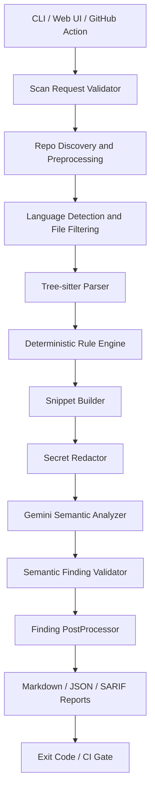

# LogSentinel

LogSentinel is an agentic logging and exception-handling analyzer for Python and Java repositories. It combines Tree-sitter parsing, deterministic OWASP-inspired rules, and optional Gemini semantic review to detect insecure logging, swallowed exceptions, sensitive-data exposure, and unsafe error-handling patterns.

## Why It Exists

Logging and exception handling failures create avoidable production and security risk: leaked secrets, missing audit trails, noisy unstructured logs, swallowed errors, and raw stack traces returned to callers. LogSentinel focuses on those issues instead of broad vulnerability scanning.

## Quickstart

```powershell
python -m venv .venv
.\.venv\Scripts\Activate.ps1
python -m pip install -U pip
python -m pip install -e ".[dev]"
logsentinel-scan . --no-semantic
```

With Docker:

```powershell
docker build -t logsentinel .
docker run --rm -v C:\path\to\repo:/repo logsentinel logsentinel-scan /repo --no-semantic
```

## CLI Usage

```powershell
logsentinel-scan . --no-semantic
logsentinel-scan . --format markdown,json,sarif
logsentinel-scan . --fail-on high
logsentinel-scan . --config logsentinel.yml
```

Exit codes:

- `0`: no findings at or above the fail threshold
- `1`: findings at or above the fail threshold
- `2`: scan, config, or runtime error

Reports are written to `reports/` by default. Markdown, JSON, and SARIF 2.1.0 are supported.

## Web UI

```powershell
logsentinel-web
```

Open `http://127.0.0.1:8000`. The UI is intended for localhost. Runtime errors show a generic message and an `error_id`; details are logged server-side.

## Semantic Analysis

Gemini is optional. Set an API key only when semantic analysis is needed:

```powershell
$env:GEMINI_API_KEY = "your-key"
$env:GEMINI_MODEL = "gemini-3.5-flash"
```

Semantic output is treated as untrusted candidate findings. `SemanticFindingValidator` rejects invented rules, invented paths, invalid line numbers, missing evidence, low confidence, and findings that do not align with the local rule catalog.

## Configuration

Copy the example config:

```powershell
Copy-Item logsentinel.example.yml logsentinel.yml
```

`logsentinel.yml` controls languages, ignore patterns, file limits, semantic settings, report formats, and CI fail severity. `.logsentinelignore` supports repository-specific ignore patterns.

## Architecture



## Rule Catalog

Rules live in `src/rules/owasp_logging_exception.json` and include OWASP source references.

| Rule | Title |
| --- | --- |
| `LOG-001` | Security-relevant events are logged |
| `LOG-002` | Log entries include investigation context |
| `LOG-003` | Sensitive data is excluded from logs |
| `LOG-004` | Untrusted event data is sanitized before logging |
| `LOG-005` | Application-wide logging mechanism is used |
| `LOG-006` | Logging failures do not break application flow or leak information |
| `LOG-007` | Required logging cannot be completely disabled |
| `ERR-001` | Unexpected errors return generic responses and are logged server-side |
| `ERR-002` | Technical error details are not exposed to callers |
| `ERR-003` | Caught exceptions are logged or propagated |

Sample finding:

```json
{
  "rule_id": "LOG-003",
  "severity": "high",
  "path": "app.py",
  "line": 12,
  "evidence": "[REDACTED_SECRET]",
  "fingerprint": "stable-partial-fingerprint"
}
```

## GitHub Action

```yaml
- uses: Deepudk04/log-sentinel-agent@v1
  with:
    path: "."
    semantic_enabled: "false"
    fail_on: "high"
    output_format: "sarif"
    upload_sarif: "true"
```

See `docs/github-action.md` for all inputs.

## Evaluation

```powershell
python evaluation/run_evaluation.py
```

The evaluation harness scans labeled Python and Java fixtures without real Gemini calls and writes metrics to `evaluation/metrics.md`.

## Development

```powershell
ruff check .
pytest
pytest --cov=src --cov-report=term-missing
```

Useful docs:

- `docs/architecture.md`
- `docs/configuration.md`
- `docs/rule-authoring.md`
- `docs/evaluation.md`
- `docs/security.md`
- `docs/github-action.md`
