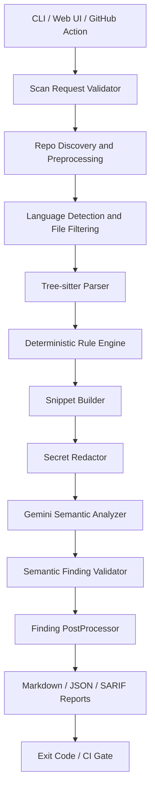

# Architecture

LogSentinel scans Python and Java repositories with a deterministic-first pipeline. Tree-sitter parsing and rule plugins produce local findings. Optional Gemini review receives only minimized, redacted snippets and returns candidate findings that must pass deterministic validation before they appear in reports.

The core trust boundary is between Gemini output and accepted findings. Semantic output is treated as untrusted data until `SemanticFindingValidator` confirms rule IDs, paths, line ranges, evidence, confidence, and catalog alignment.
